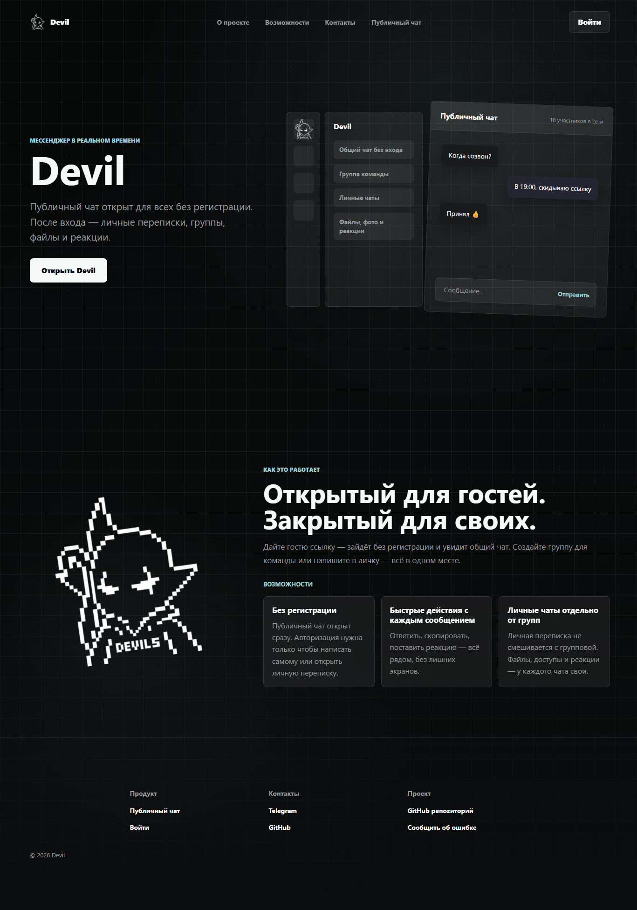
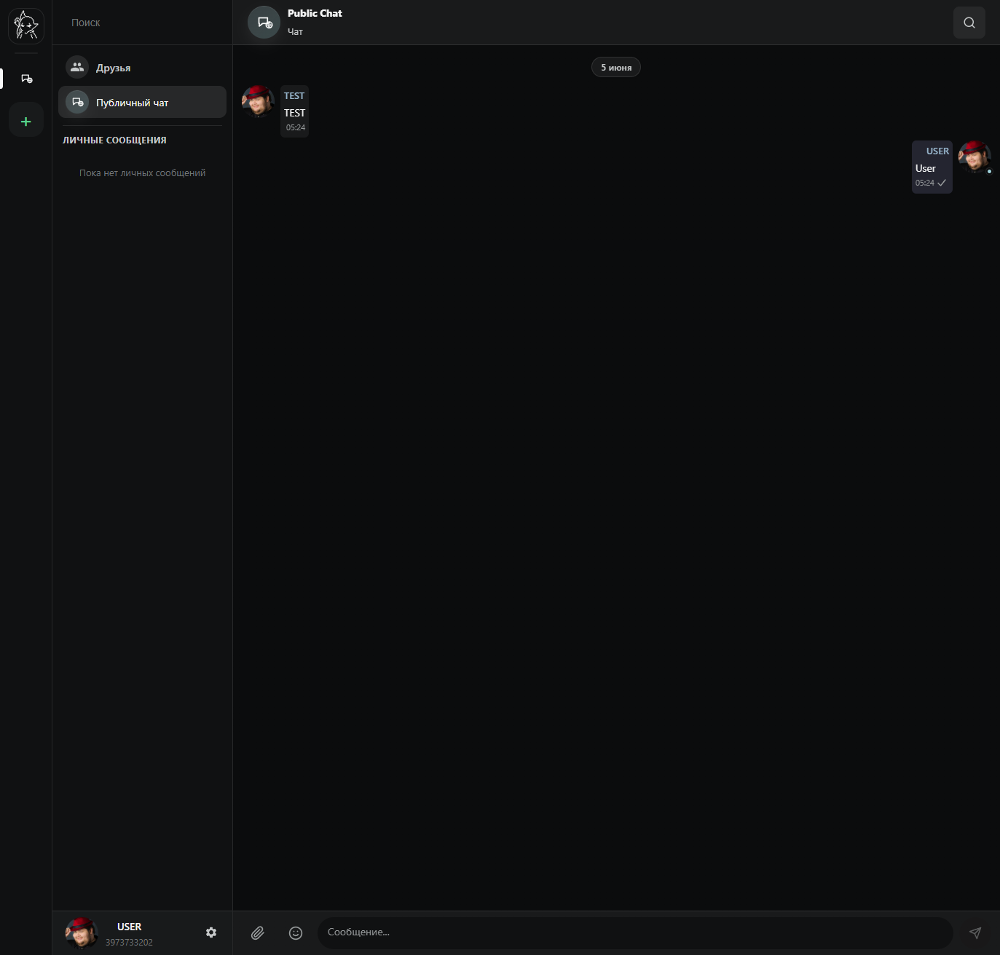

<div align="center">
  
  <a href="https://deepwiki.com/asdAet/Devil"></a>
  <p><strong>Realtime-мессенджер для личного и командного общения</strong></p>
  <p>Devil — веб-приложение для закрытых диалогов, групповых комнат и быстрого обмена сообщениями в реальном времени. Проект объединяет чат, presence, роли, вложения и production-инфраструктуру в одной системе.</p>
</div>

## Скриншоты

<table>
  <tr>
    <td width="50%" align="center">
      
      <br>
      <sub>Лендинг продукта</sub>
    </td>
    <td width="50%" align="center">
      
      <br>
      <sub>Публичный чат</sub>
    </td>
  </tr>
</table>

---

## Стек

- Backend: Python 3.11, Django, Django REST Framework, Channels, Redis, PostgreSQL
- Frontend: React 19, TypeScript, Vite, React Router, Zod
- Тесты: pytest, Vitest, Playwright
- Production: Docker Compose, Nginx, Certbot

## Структура

```text
backend/                  Django API, WebSocket и доменная логика
frontend/                 React SPA
deploy/                   Nginx, Certbot и observability
docs/                     Сгенерированная документация и UML
tools/                    Скрипты репозитория
docker-compose.prod.yml   Production compose
example.env               Шаблон production-переменных
```

## Локальный запуск

Backend:

```powershell
cd backend
python -m venv .venv
.\.venv\Scripts\Activate.ps1
pip install -r requirements-dev.txt
python manage.py migrate
python manage.py runserver 127.0.0.1:8000
```

Frontend:

```powershell
cd frontend
npm ci
npm run dev -- --host 127.0.0.1 --port 5173
```

Локальный frontend dev server ожидает, что API уже доступен. Vite проксирует `/api`
и `/ws` на `VITE_BACKEND_ORIGIN` или, по умолчанию, на `http://127.0.0.1:8000`.

## Проверки

Backend:

```powershell
cd backend
pytest
```

Frontend:

```powershell
cd frontend
npm run lint
npm run lint:css
npm run check:dto-boundary
npm run test:unit
npm run build
npm run test:e2e
```

## Контракты

- Внешние chat targets резолвятся через `POST /api/chat/resolve/`.
- В URL используются публичные refs и ids; runtime-операции backend работают через `roomId`.
- Основной chat WebSocket: `/ws/chat/`.
- Активная комната в `/ws/chat/` меняется событием `set_active_room`.
- Direct inbox WebSocket: `/ws/inbox/`.
- Presence WebSocket: `/ws/presence/`.
- Media URL подписываются и имеют TTL.

## Production

Создать `.env` на основе [example.env](example.env), заполнить секреты и запустить:

```powershell
docker compose -f docker-compose.prod.yml -f deploy/observability/compose.yml up --build -d
```

Обязательные production-переменные:

- `DJANGO_SECRET_KEY`
- `POSTGRES_PASSWORD`
- `DJANGO_ALLOWED_HOSTS`
- `DJANGO_CSRF_TRUSTED_ORIGINS`
- `DJANGO_CORS_ALLOWED_ORIGINS`
- `DJANGO_PUBLIC_BASE_URL`
- `USER_AVATAR_UPLOAD_DIR`
- `GROUP_AVATAR_UPLOAD_DIR`
- `USER_PASSWORD_DEFAULT_AVATAR`
- `USER_OAUTH_DEFAULT_AVATAR`
- `GROUP_DEFAULT_AVATAR`

Bundled default avatar files live in `backend/assets/avatars/`. The env values above remain public media paths, for example `avatars/Password_defualt.svg`. Default paths are resolved at request time and are not stored in profile or group avatar fields, so changing `.env` applies to every entity without a custom upload.

Observability описан в [deploy/observability/README.md](deploy/observability/README.md).

### WebSocket в production

В production WebSocket работает через тот же публичный origin, что и SPA:

- при `https://example.com` frontend открывает `wss://example.com/ws/...`;
- nginx принимает `/ws/` и проксирует соединение во внутренний `backend:8000`;
- `VITE_BACKEND_ORIGIN` и `VITE_WS_BACKEND_ORIGIN` для production не нужны.

## Документация

- [Backend reference](docs/generated/backend-reference.md)
- [Frontend reference](docs/generated/frontend-reference.md)
- [UML](docs/uml/README.md)

Перегенерация:

```powershell
python tools/generate_project_docs.py
```
